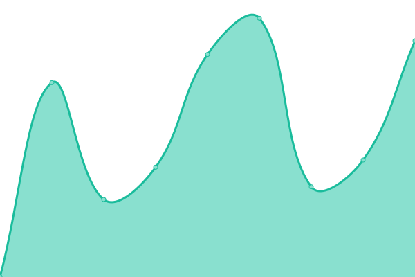
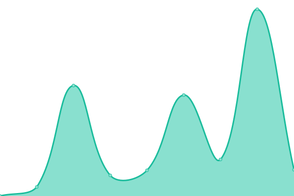
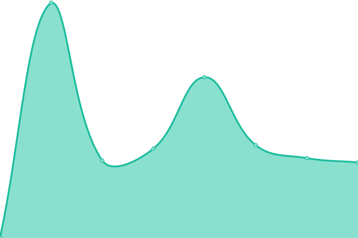
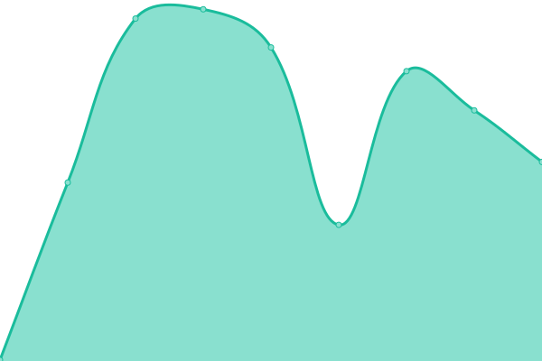
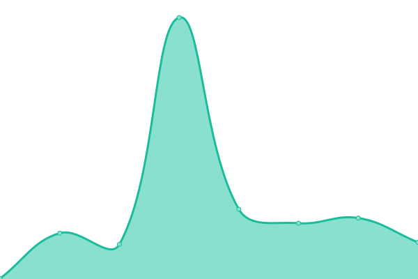
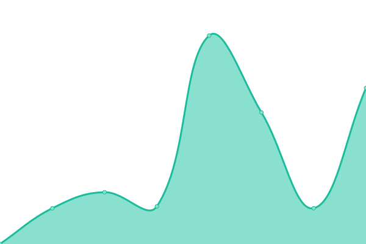
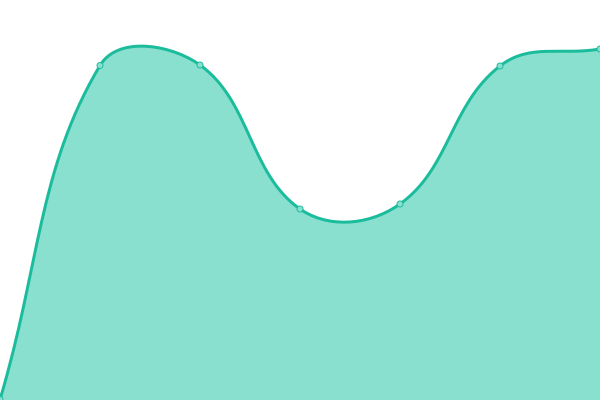
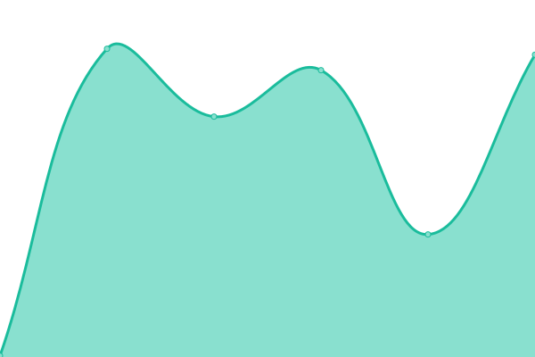
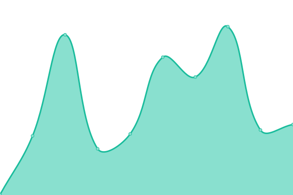
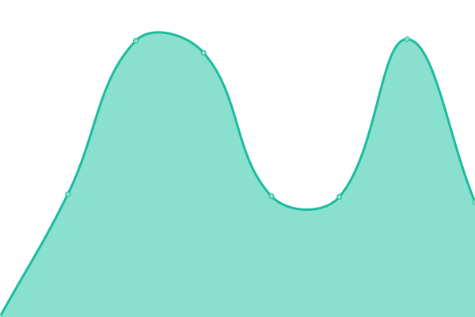

# [📈 Live Status](https://upptime.github.io/upptime): <!--live status--> **🟩 All systems operational**

This repository contains the open-source uptime monitor and status page for [Upptime](https://upptime.js.org), powered by [Upptime](https://github.com/upptime/upptime).

With [Upptime](https://upptime.js.org), you can get your own unlimited and free uptime monitor and status page, powered entirely by a GitHub repository. We use [Issues](https://github.com/upptime/upptime/issues) as incident reports, [Actions](https://github.com/0xb0y/status/actions) as uptime monitors, and [Pages](https://upptime.github.io/upptime) for the status page.

<!--start: status pages-->
<!-- This summary is generated by Upptime (https://github.com/upptime/upptime) -->
<!-- Do not edit this manually, your changes will be overwritten -->
<!-- prettier-ignore -->
| URL | Status | History | Response Time | Uptime |
| --- | ------ | ------- | ------------- | ------ |
|  [Sinkaroid Frontbase](https://sinkaroid.io) | 🟩 Up | [sinkaroid-frontbase.yml](https://github.com/0xb0y/status/commits/HEAD/history/sinkaroid-frontbase.yml) | 

 210ms
     
 | 

<a href="https://status.scathach.dev/history/sinkaroid-frontbase">100.00%</a>
    

|  [Chaldea Landing Page](https://chaldea.dev) | 🟩 Up | [chaldea-landing-page.yml](https://github.com/0xb0y/status/commits/HEAD/history/chaldea-landing-page.yml) | 

 268ms
     
 | 

<a href="https://status.scathach.dev/history/chaldea-landing-page">100.00%</a>
    

|  [Scathach Landing Page](http://scathach.dev) | 🟩 Up | [scathach-landing-page.yml](https://github.com/0xb0y/status/commits/HEAD/history/scathach-landing-page.yml) | 

 313ms
     
 | 

<a href="https://status.scathach.dev/history/scathach-landing-page">100.00%</a>
    

|  [V3 REST](https://scathach.redsplit.org/api) | 🟩 Up | [v3-rest.yml](https://github.com/0xb0y/status/commits/HEAD/history/v3-rest.yml) | 

 492ms
     
 | 

<a href="https://status.scathach.dev/history/v3-rest">100.00%</a>
    

|  [BotsForDiscord SDK](https://discords.com/bots) | 🟩 Up | [bots-for-discord-sdk.yml](https://github.com/0xb0y/status/commits/HEAD/history/bots-for-discord-sdk.yml) | 

 814ms
     
 | 

<a href="https://status.scathach.dev/history/bots-for-discord-sdk">100.00%</a>
    

|  [CDN ngocok-static](https://static.hentaicdn.com) | 🟩 Up | [cdn-ngocok-static.yml](https://github.com/0xb0y/status/commits/HEAD/history/cdn-ngocok-static.yml) | 

 151ms
     
 | 

<a href="https://status.scathach.dev/history/cdn-ngocok-static">100.00%</a>
    

|  [CDN ngocok-dikalasedih](https://cdn.pururin.io) | 🟩 Up | [cdn-ngocok-dikalasedih.yml](https://github.com/0xb0y/status/commits/HEAD/history/cdn-ngocok-dikalasedih.yml) | 

 1906ms
     
 | 

<a href="https://status.scathach.dev/history/cdn-ngocok-dikalasedih">100.00%</a>
    

|  [WebMail](https://scathach.redsplit.org:2096) | 🟩 Up | [web-mail.yml](https://github.com/0xb0y/status/commits/HEAD/history/web-mail.yml) | 

 305ms
     
 | 

<a href="https://status.scathach.dev/history/web-mail">100.00%</a>
    

|  [Loli Minor Appeals](https://scathach.redsplit.org/static/?params) | 🟩 Up | [loli-minor-appeals.yml](https://github.com/0xb0y/status/commits/HEAD/history/loli-minor-appeals.yml) | 

 133ms
     
 | 

<a href="https://status.scathach.dev/history/loli-minor-appeals">100.00%</a>
    

|  [Nhentai Graber](http://miyako.redsplit.org) | 🟩 Up | [nhentai-graber.yml](https://github.com/0xb0y/status/commits/HEAD/history/nhentai-graber.yml) | 

 1464ms
     
 | 

<a href="https://status.scathach.dev/history/nhentai-graber">100.00%</a>
    

|  [Cabul Reddit](http://192.145.238.5/~pasirm5/v3/cabul/?hentai) | 🟩 Up | [cabul-reddit.yml](https://github.com/0xb0y/status/commits/HEAD/history/cabul-reddit.yml) | 

 848ms
     
 | 

<a href="https://status.scathach.dev/history/cabul-reddit">99.79%</a>
    

|  [Konachan](https://konachan.com/post.json?) | 🟩 Up | [konachan.yml](https://github.com/0xb0y/status/commits/HEAD/history/konachan.yml) | 

 952ms
     
 | 

<a href="https://status.scathach.dev/history/konachan">100.00%</a>
    

|  [Konachan SFW](https://konachan.net/post.json?) | 🟩 Up | [konachan-sfw.yml](https://github.com/0xb0y/status/commits/HEAD/history/konachan-sfw.yml) | 

 729ms
     
 | 

<a href="https://status.scathach.dev/history/konachan-sfw">100.00%</a>
    

|  [Gelbooru](https://gelbooru.com/index.php?page=dapi&s=post&q=index&limit=50&tags=yuri) | 🟩 Up | [gelbooru.yml](https://github.com/0xb0y/status/commits/HEAD/history/gelbooru.yml) | 

 491ms
     
 | 

<a href="https://status.scathach.dev/history/gelbooru">100.00%</a>
    

|  [Safebooru](https://safebooru.org/index.php?page=dapi&s=post&q=index&limit=50&tags=bikini&json=1) | 🟩 Up | [safebooru.yml](https://github.com/0xb0y/status/commits/HEAD/history/safebooru.yml) | 

 735ms
     
 | 

<a href="https://status.scathach.dev/history/safebooru">100.00%</a>
    

|  [Danbooru](https://danbooru.donmai.us/posts.json) | 🟩 Up | [danbooru.yml](https://github.com/0xb0y/status/commits/HEAD/history/danbooru.yml) | 

 396ms
     
 | 

<a href="https://status.scathach.dev/history/danbooru">100.00%</a>
    

|  [R34](https://rule34.xxx/index.php?page=dapi&s=post&q=index&limit=5&tags=shirase_sakuya&pid=1) | 🟩 Up | [r34.yml](https://github.com/0xb0y/status/commits/HEAD/history/r34.yml) | 

 424ms
     
 | 

<a href="https://status.scathach.dev/history/r34">100.00%</a>
    

|  [Xbooru](https://xbooru.com/index.php?page=dapi&s=post&q=index&limit=50&tags=milf) | 🟩 Up | [xbooru.yml](https://github.com/0xb0y/status/commits/HEAD/history/xbooru.yml) | 

 468ms
     
 | 

<a href="https://status.scathach.dev/history/xbooru">100.00%</a>
    

|  [TBIB](https://tbib.org/index.php?page=dapi&s=post&q=index&limit=50&tags=pregnant) | 🟩 Up | [tbib.yml](https://github.com/0xb0y/status/commits/HEAD/history/tbib.yml) | 

 593ms
     
 | 

<a href="https://status.scathach.dev/history/tbib">100.00%</a>
    

|  [Realbooru](https://realbooru.com/index.php?page=dapi&s=post&q=index&limit=5&tags=slave) | 🟩 Up | [realbooru.yml](https://github.com/0xb0y/status/commits/HEAD/history/realbooru.yml) | 

 380ms
     
 | 

<a href="https://status.scathach.dev/history/realbooru">100.00%</a>
    

|  [Yandere](https://yande.re/post.xml?limit=5&tags=bikini) | 🟩 Up | [yandere.yml](https://github.com/0xb0y/status/commits/HEAD/history/yandere.yml) | 

 376ms
     
 | 

<a href="https://status.scathach.dev/history/yandere">99.85%</a>
    

|  [MSpa](https://mspabooru.com/index.php?page=dapi&s=post&q=index&limit=10) | 🟩 Up | [m-spa.yml](https://github.com/0xb0y/status/commits/HEAD/history/m-spa.yml) | 

 638ms
     
 | 

<a href="https://status.scathach.dev/history/m-spa">100.00%</a>
    

|  [Sakuga](https://www.sakugabooru.com/post.json) | 🟩 Up | [sakuga.yml](https://github.com/0xb0y/status/commits/HEAD/history/sakuga.yml) | 

 291ms
     
 | 

<a href="https://status.scathach.dev/history/sakuga">100.00%</a>
    

|  [Yukkuri](https://yukkuri.shii.org/posts.json) | 🟩 Up | [yukkuri.yml](https://github.com/0xb0y/status/commits/HEAD/history/yukkuri.yml) | 

 1352ms
     
 | 

<a href="https://status.scathach.dev/history/yukkuri">100.00%</a>
    

|  [HypnoHub](https://hypnohub.net/post.xml?limit=3&tags=incest) | 🟩 Up | [hypno-hub.yml](https://github.com/0xb0y/status/commits/HEAD/history/hypno-hub.yml) | 

 383ms
     
 | 

<a href="https://status.scathach.dev/history/hypno-hub">100.00%</a>
    

|  [Nhentai](https://nhentai.net/api/gallery/1) | 🟩 Up | [nhentai.yml](https://github.com/0xb0y/status/commits/HEAD/history/nhentai.yml) | 

 312ms
     
 | 

<a href="https://status.scathach.dev/history/nhentai">99.81%</a>
    

|  [PornPics](https://www.pornpics.com/) | 🟩 Up | [porn-pics.yml](https://github.com/0xb0y/status/commits/HEAD/history/porn-pics.yml) | 

 258ms
     
 | 

<a href="https://status.scathach.dev/history/porn-pics">100.00%</a>
    

|  [JavPics](https://javhd.pics/) | 🟩 Up | [jav-pics.yml](https://github.com/0xb0y/status/commits/HEAD/history/jav-pics.yml) | 

 216ms
     
 | 

<a href="https://status.scathach.dev/history/jav-pics">100.00%</a>
    

|  [Liquipedia Dota](https://liquipedia.net/dota2/Main_Page) | 🟩 Up | [liquipedia-dota.yml](https://github.com/0xb0y/status/commits/HEAD/history/liquipedia-dota.yml) | 

 486ms
     
 | 

<a href="https://status.scathach.dev/history/liquipedia-dota">100.00%</a>
    

|  [Dotabuff](https://dotabuff.com/) | 🟩 Up | [dotabuff.yml](https://github.com/0xb0y/status/commits/HEAD/history/dotabuff.yml) | 

 313ms
     
 | 

<a href="https://status.scathach.dev/history/dotabuff">100.00%</a>
    

|  [OpenDota](https://www.opendota.com/) | 🟩 Up | [open-dota.yml](https://github.com/0xb0y/status/commits/HEAD/history/open-dota.yml) | 

 207ms
     
 | 

<a href="https://status.scathach.dev/history/open-dota">100.00%</a>
    

|  [MMR Leaderboards](https://www.dota2.com/leaderboards/#se_asia-0) | 🟩 Up | [mmr-leaderboards.yml](https://github.com/0xb0y/status/commits/HEAD/history/mmr-leaderboards.yml) | 

 644ms
     
 | 

<a href="https://status.scathach.dev/history/mmr-leaderboards">99.81%</a>
    

|  [MarketCap](https://coinmarketcap.com/currencies/ethereum/) | 🟩 Up | [market-cap.yml](https://github.com/0xb0y/status/commits/HEAD/history/market-cap.yml) | 

 128ms
     
 | 

<a href="https://status.scathach.dev/history/market-cap">100.00%</a>
    

|  [Pururin](http://pururin.io/) | 🟩 Up | [pururin.yml](https://github.com/0xb0y/status/commits/HEAD/history/pururin.yml) | 

 1971ms
     
 | 

<a href="https://status.scathach.dev/history/pururin">100.00%</a>
    

|  [HentaiFox](https://hentaifox.com/) | 🟩 Up | [hentai-fox.yml](https://github.com/0xb0y/status/commits/HEAD/history/hentai-fox.yml) | 

 618ms
     
 | 

<a href="https://status.scathach.dev/history/hentai-fox">100.00%</a>
    

|  [Hentai2Read](https://hentai2read.com/) | 🟩 Up | [hentai2-read.yml](https://github.com/0xb0y/status/commits/HEAD/history/hentai2-read.yml) | 

 210ms
     
 | 

<a href="https://status.scathach.dev/history/hentai2-read">100.00%</a>
    

|  [HentaiHere](https://hentaihere.com/) | 🟩 Up | [hentai-here.yml](https://github.com/0xb0y/status/commits/HEAD/history/hentai-here.yml) | 

 443ms
     
 | 

<a href="https://status.scathach.dev/history/hentai-here">100.00%</a>
    

|  [HentaiHere](https://hentaihere.com) | 🟩 Up | [hentai-here.yml](https://github.com/0xb0y/status/commits/HEAD/history/hentai-here.yml) | 

 443ms
     
 | 

<a href="https://status.scathach.dev/history/hentai-here">100.00%</a>
    

|  [Jikan](https://api.jikan.moe/v3) | 🟩 Up | [jikan.yml](https://github.com/0xb0y/status/commits/HEAD/history/jikan.yml) | 

 2592ms
     
 | 

<a href="https://status.scathach.dev/history/jikan">89.88%</a>
    

|  [Kitsu](https://kitsu.io/) | 🟩 Up | [kitsu.yml](https://github.com/0xb0y/status/commits/HEAD/history/kitsu.yml) | 

 410ms
     
 | 

<a href="https://status.scathach.dev/history/kitsu">100.00%</a>
    

|  [Usagi](http://usagi.org/) | 🟩 Up | [usagi.yml](https://github.com/0xb0y/status/commits/HEAD/history/usagi.yml) | 

 3732ms
     
 | 

<a href="https://status.scathach.dev/history/usagi">100.00%</a>
    

|  [animenewsnetwork](https://www.animenewsnetwork.com/) | 🟩 Up | [animenewsnetwork.yml](https://github.com/0xb0y/status/commits/HEAD/history/animenewsnetwork.yml) | 

 425ms
     
 | 

<a href="https://status.scathach.dev/history/animenewsnetwork">100.00%</a>
    

|  [Anitrendz](https://anitrendz.net/) | 🟩 Up | [anitrendz.yml](https://github.com/0xb0y/status/commits/HEAD/history/anitrendz.yml) | 

 388ms
     
 | 

<a href="https://status.scathach.dev/history/anitrendz">99.74%</a>
    

|  [AlphaCoders](https://wall.alphacoders.com/) | 🟩 Up | [alpha-coders.yml](https://github.com/0xb0y/status/commits/HEAD/history/alpha-coders.yml) | 

 579ms
     
 | 

<a href="https://status.scathach.dev/history/alpha-coders">100.00%</a>
    

|  [Blockchain Pool/Stats](https://api.blockchain.info/stats) | 🟩 Up | [blockchain-pool-stats.yml](https://github.com/0xb0y/status/commits/HEAD/history/blockchain-pool-stats.yml) | 

 197ms
     
 | 

<a href="https://status.scathach.dev/history/blockchain-pool-stats">100.00%</a>
    

|  [JOI waifu](http://jurnalotaku.com/) | 🟩 Up | [joi-waifu.yml](https://github.com/0xb0y/status/commits/HEAD/history/joi-waifu.yml) | 

 1282ms
     
 | 

<a href="https://status.scathach.dev/history/joi-waifu">99.05%</a>
    

|  [SauceNAO wrapper](https://saucenao.com/index.php) | 🟩 Up | [sauce-nao-wrapper.yml](https://github.com/0xb0y/status/commits/HEAD/history/sauce-nao-wrapper.yml) | 

 322ms
     
 | 

<a href="https://status.scathach.dev/history/sauce-nao-wrapper">100.00%</a>
    

|  [Nekos](https://nekos.life/) | 🟩 Up | [nekos.yml](https://github.com/0xb0y/status/commits/HEAD/history/nekos.yml) | 

 138ms
     
 | 

<a href="https://status.scathach.dev/history/nekos">98.24%</a>
    

|  [Nekobot](https://nekobot.xyz/) | 🟩 Up | [nekobot.yml](https://github.com/0xb0y/status/commits/HEAD/history/nekobot.yml) | 

 524ms
     
 | 

<a href="https://status.scathach.dev/history/nekobot">100.00%</a>
    

|  [rest_countries](https://restcountries.eu/) | 🟩 Up | [rest-countries.yml](https://github.com/0xb0y/status/commits/HEAD/history/rest-countries.yml) | 

 178ms
     
 | 

<a href="https://status.scathach.dev/history/rest-countries">100.00%</a>
    

|  [geo_ip](https://ipinfo.io/) | 🟩 Up | [geo-ip.yml](https://github.com/0xb0y/status/commits/HEAD/history/geo-ip.yml) | 

 120ms
     
 | 

<a href="https://status.scathach.dev/history/geo-ip">100.00%</a>
    

<!--end: status pages-->

[**Visit our status website →**](https://upptime.github.io/upptime)

## 📄 License

- Powered by: [Upptime](https://github.com/upptime/upptime)
- Code: [MIT](./LICENSE) © [Upptime](https://upptime.js.org)
- Data in the `./history` directory: [Open Database License](https://opendatacommons.org/licenses/odbl/1-0/)
