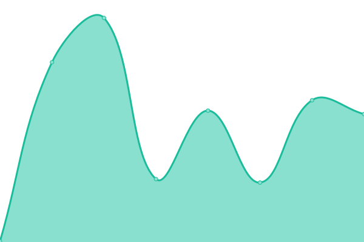
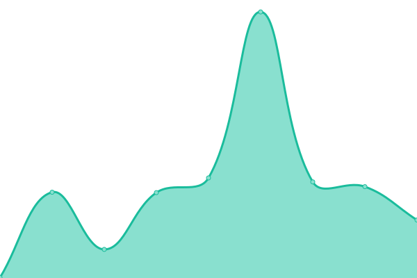

# [📈 Live Status](https://upptime.github.io/upptime): <!--live status--> **🟩 All systems operational**

This repository contains the open-source uptime monitor and status page for [Upptime](https://upptime.js.org), powered by [Upptime](https://github.com/upptime/upptime).

With [Upptime](https://upptime.js.org), you can get your own unlimited and free uptime monitor and status page, powered entirely by a GitHub repository. We use [Issues](https://github.com/upptime/upptime/issues) as incident reports, [Actions](https://github.com/0xb0y/status/actions) as uptime monitors, and [Pages](https://upptime.github.io/upptime) for the status page.

<!--start: status pages-->
<!-- This summary is generated by Upptime (https://github.com/upptime/upptime) -->
<!-- Do not edit this manually, your changes will be overwritten -->
<!-- prettier-ignore -->
| URL | Status | History | Response Time | Uptime |
| --- | ------ | ------- | ------------- | ------ |
|  [Sinkaroid Frontbase](https://sinkaroid.io) | 🟩 Up | [sinkaroid-frontbase.yml](https://github.com/0xb0y/status/commits/HEAD/history/sinkaroid-frontbase.yml) | 

 218ms
     
 | 

<a href="https://status.scathach.dev/history/sinkaroid-frontbase">100.00%</a>
    

|  [Chaldea Landing Page](https://chaldea.dev) | 🟩 Up | [chaldea-landing-page.yml](https://github.com/0xb0y/status/commits/HEAD/history/chaldea-landing-page.yml) | 

 224ms
     
 | 

<a href="https://status.scathach.dev/history/chaldea-landing-page">100.00%</a>
    

|  [Scathach Landing Page](http://scathach.dev) | 🟩 Up | [scathach-landing-page.yml](https://github.com/0xb0y/status/commits/HEAD/history/scathach-landing-page.yml) | 

 334ms
     
 | 

<a href="https://status.scathach.dev/history/scathach-landing-page">100.00%</a>
    

|  [V3 REST API](https://scathach.redsplit.org/api) | 🟩 Up | [v3-rest-api.yml](https://github.com/0xb0y/status/commits/HEAD/history/v3-rest-api.yml) | 

 495ms
     
 | 

<a href="https://status.scathach.dev/history/v3-rest-api">100.00%</a>
    

|  [CDN ngocok-static](https://static.hentaicdn.com) | 🟩 Up | [cdn-ngocok-static.yml](https://github.com/0xb0y/status/commits/HEAD/history/cdn-ngocok-static.yml) | 

 148ms
     
 | 

<a href="https://status.scathach.dev/history/cdn-ngocok-static">100.00%</a>
    

|  [CDN ngocok-dikalasedih](https://cdn.pururin.io) | 🟩 Up | [cdn-ngocok-dikalasedih.yml](https://github.com/0xb0y/status/commits/HEAD/history/cdn-ngocok-dikalasedih.yml) | 

 1670ms
     
 | 

<a href="https://status.scathach.dev/history/cdn-ngocok-dikalasedih">100.00%</a>
    

|  [WebMail](https://scathach.redsplit.org:2096) | 🟩 Up | [web-mail.yml](https://github.com/0xb0y/status/commits/HEAD/history/web-mail.yml) | 

 283ms
     
 | 

<a href="https://status.scathach.dev/history/web-mail">100.00%</a>
    

|  [Loli Minor Appeals](https://scathach.redsplit.org/static/?params) | 🟩 Up | [loli-minor-appeals.yml](https://github.com/0xb0y/status/commits/HEAD/history/loli-minor-appeals.yml) | 

 107ms
     
 | 

<a href="https://status.scathach.dev/history/loli-minor-appeals">100.00%</a>
    

|  [Nhentai Graber](http://miyako.redsplit.org) | 🟩 Up | [nhentai-graber.yml](https://github.com/0xb0y/status/commits/HEAD/history/nhentai-graber.yml) | 

 216ms
     
 | 

<a href="https://status.scathach.dev/history/nhentai-graber">100.00%</a>
    

|  [CabulAPI Reddit](http://192.145.238.5/~pasirm5/v3/cabul/?hentai) | 🟩 Up | [cabul-api-reddit.yml](https://github.com/0xb0y/status/commits/HEAD/history/cabul-api-reddit.yml) | 

 925ms
     
 | 

<a href="https://status.scathach.dev/history/cabul-api-reddit">99.91%</a>
    

<!--end: status pages-->

[**Visit our status website →**](https://upptime.github.io/upptime)

## 📄 License

- Powered by: [Upptime](https://github.com/upptime/upptime)
- Code: [MIT](./LICENSE) © [Upptime](https://upptime.js.org)
- Data in the `./history` directory: [Open Database License](https://opendatacommons.org/licenses/odbl/1-0/)
